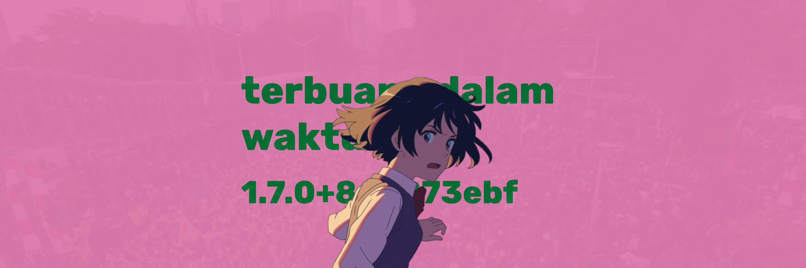

This version was tested on:
- Navidrome version: [0.56.1](https://github.com/navidrome/navidrome/releases/tag/v0.56.1)
- iOS version: [18.6](https://support.apple.com/en-us/121161)

Finally, after some time!

## 🍿 New Features & Enhancements

- Refined Tracks Queue UI: Polished UI to make playing what's next even easier

## 🐞 Bug Fixes

- Don’t sort by track number when viewing a playlist  
- Sort album tracks by disc number and track number

## 🔩 QoL Improvements

- Start playlist number from 1 instead of zero (index number thing)  
- "Play by tracks" now adds all tracks to the queue (instead of all tracks that > selectedTrack)  
- Some translation words

## 💎 Supporters

flo is a [Free/Libre Open Source Software (FLOSS)](https://www.gnu.org/philosophy/floss-and-foss.en.html) licensed under the permissive [MIT license](https://github.com/kepelet/flo/blob/develop/LICENSE), with zero tracking or ads. The mission is to become one of the best open-source Navidrome clients for iOS by giving you freedom without sacrificing fancy stuff in this modern day.

If you love flo, you can consider [sponsoring my work](https://github.com/sponsors/faultables) — every penny counts! flo wouldn't be possible without Navidrome; in fact, flo would never exist if Navidrome didn't exist! You can also consider sponsoring [Deluan](https://github.com/sponsors/deluan) for his generous contributions to Navidrome.

Your donation helps me pay bills, including the annual $99 Apple Developer Program subscription. It makes me happy too :D

And most of the time, it makes me *overproductive* too...

## 👀 Coming Soon

We can't spill all the beans just yet, but we're thrilled to give you a sneak peek of what's coming in the next flo release:

- **Lyrics**: Karaoke, anyone?  
- **Better queue**: Wanna play *Caramelldansen* right after *Watch the World Burn*?  
- **Better resources**: Batteries, bandwidth, and all limited things... We could do better.

Today I spent more time booting on [Fedora Asahi Remix](https://asahilinux.org/fedora/) (it's really good on MBA M2, even with `apple_dcp.show_notch=1`!) and accidentally learning C++ to build things with Qt. GTK seems more intuitive, but I really love KDE.

Let's see where the path will lead :)
