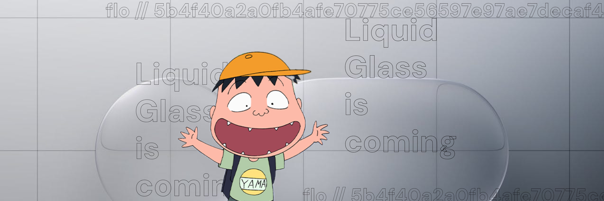

This version was tested on:

- Navidrome version: [0.58.0](https://github.com/navidrome/navidrome/releases/tag/v0.58.0)
- iOS version: 18.6 & 26.3

flo 2.0 is here. This update welcomes liquid glass on iOS 26 while keeping our friends on iOS 16+ happy (hello fellow iPhone XS user!)

## 🍿 New Features & Enhancements

- Lyrics via [LRCLIB](https://dub.sh/flo-lrclib) [#57](https://github.com/kepelet/flo/issues/57). Damn, finally. Go ahead and do some karaoke!
- You can now listen to **Web Radios** directly in flo. Thanks to [@f-longobardi](https://github.com/f-longobardi)
- Added "sort by album artist" to prevent clutter [#89](https://github.com/kepelet/flo/issues/89). Thanks to [@f-longobardi](https://github.com/f-longobardi) again!
- That AirPlay button is working now. Remember when it used to be disabled since forever?
- New "mini player" looks. The "use translucent background" feature used to be experimental, and now everyone is using it:
both on iOS 26 (native liquid glass) and iOS 16+ (we mimic the liquid glass lol)
- Some little adjustments to the "home view" to make it look cooler

## 🐞 Bug Fixes

- Performance improvements for large playback queues [#84](https://github.com/kepelet/flo/issues/84). Thanks to [@r1sim](https://github.com/r1sim)
- Improved playback stability for tricky stream cases
- Fixed layout issues on smaller screens
- Reduced chances of unexpected app crashes in error scenarios

## 🔩 QoL Improvements

- CoreData-related code refactor
- Extra guards for regex usage

## 💎 Supporters

This release was helped by [@f-longobardi](https://github.com/f-longobardi) and [@r1sim](https://github.com/r1sim), thank you for your contributions!
